# Pandu (pandu-jev) Kanban

**Project:** Pandu (pandu-jev) — Tiny Local Zero-Cost Policy Model & Uncertainty Research
**Goal:** Build a tiny, local, zero-API-cost decision/policy model that acts in closed-loop environments, learns from expert demonstrations and RL, exposes calibrated confidence, and benchmarks hybrid fallback against expensive teacher models.

**References:**
- [RESEARCH_PLAN.md](docs/RESEARCH_PLAN.md)
- [PLAN.md](docs/PLAN.md)
- [RESEARCH.md](docs/RESEARCH.md)
- [GROUNDED_LANGUAGE_ARCHITECTURE.md](docs/GROUNDED_LANGUAGE_ARCHITECTURE.md)
- [README.md](README.md)
- [chess.png](chess.png)
- [snake.png](snake.png)

**Research framing note (2026-09-21 review):** Project direction has shifted from "tiny language-conditioned policy" to **ultra-small embodied policy under independent control of perception (representation dim), temporal memory (GRU), and policy capacity**. Key open threads: single-step accuracy ≠ closed-loop competence; Oracle Intent 0% under Fog-of-War (state estimation vs target info); belief-state/POMDP framing; EXP-005 clean representation scaling. RESOLVED (2026-09-21): 64d wall-hit anomaly caused by 16-cell 5x5 local-occupancy ring artifact (not a metric bug or capacity confound). No more LM-scaling experiments — priority is the representation × memory × capacity experiments.

---

## Kanban Board Overview

```mermaid
kanban
  backlog[Backlog]
    t43["JEV-002 Ultra-Lightweight CoreML / ANE Neural Engine Export for Pandu Micro-Policy"]
    t42["JEV-003 AgentWorld Environment & Software Task Decision Policy (PLAN Phase 12-14)"]

  todo[To Do]

  inprogress[In Progress]

  blocked[Blocked]

  done[Done]
    t47["EXP-013 Hardware Acceleration Benchmark: Pandu-Jev ANE vs Laya-CoreML (Sub-ms Latency & W8 967 DPS)"]
    t46["JEV-005 Apple Neural Engine (ANE) Architecture Port & CoreML Acceleration for Pandu-Jev NLP (<1ms Latency & W8 Palettization Over Laya)"]
    t45["JEV-004 Pandu Universal System One Multi-Domain Policy & Developer Router (149M Base & 19.3M Tiny)"]
    t44["EXP-012 Three-Way Snake Arena: Pandu-Jev vs Laya-CoreML vs Jev (TypeSafe System One Live API)"]
    t41["EXP-011 Empirical Comparison: Pandu-Jev NLP vs Laya-CoreML (ModernBERT-Tiny vs ModernBERT-Base 322M)"]
    t40["JEV-001 Pandu-Jev NLP Typed Decision Architecture (~19.3M ModernBERT-Tiny Backbone & Zero-Token Schema)"]
    t39["CHS-004 Canonical Perspective Mirroring, 2-Ply Quiescence Guard & Tactical Hegemony (90% Win Rate)"]
    t38["GUI-003 Deep Curriculum Policy (44.7K) & Strategic Intent Telemetry in Chess GUI"]
    t37["EXP-010 Capacity-Controlled Chess Scaling (Can 44K Params Learn Tactical Depth & Endgames?)"]
    t36["TRN-003 Deep 8-Tier Chess Curriculum (Positional -> Tactics -> Endgames -> Distillation)"]
    t35["CHS-003 Multi-Target Auxiliary Supervision (Strategic Intent Head & Multi-Task Loss)"]
    t34["EXP-009 Micro-Policy Chess Benchmark (1,000 Games, Mate-in-1, Sub-ms Latency)"]
    t33["TRN-002 Chess Curriculum Training Pipeline (Legal -> Material -> Tactics -> Strategy)"]
    t32["CHS-002 Pandu Chess Feature Encoder (224d) & Factorized Legal-Masked Policy"]
    t31["GUI-002 Interactive Snake GUI with Easy/Medium/Hard Levels & Solo/Duel/Spectator Modes"]
    t30["GUI-001 Interactive Chess GUI with Auto-Run Turn-Based Engine & Human-vs-Bot Play"]
    t29["EVO-001 Self-Play & Evolutionary Tournament Engine"]
    t28["CHS-001 Micro Chess Environment & Legal Move Policy"]
    t27["SNK-001 Competitive Snake Bot-vs-Bot Arena & Policy"]
    t26["ARN-001 Universal Multi-Agent Arena Framework"]
    t25["EXP-008 64d Feature Group Ablation & Information Density"]
    t23["EXP-007 GRU Hidden-State Probing"]
    t22["EXP-006 Oracle-Intent 0% Under Fog-of-War Investigation"]
    t20["EXP-005 Parameter-Normalized 2D Scaling Law (clean reps)"]
    t19["EXP-004 Memory x Representation Matrix (CLEAN reps)"]
    t21["BUG-001 Audit 64d Wall-Hit Anomaly (RESOLVED: 5x5 ring)"]
    t1["ENV-001 Universal Interface & Scaffold"]
    t2["ENV-002 GridWorld Environment Implementation"]
    t3["ENV-003 2D Continuous Racing Environment"]
    t4["EXP-001 A* Expert Policy and Dataset Generator"]
    t5["MOD-001 Tiny Policy Networks Architecture"]
    t6["TRN-001 Behavioral Cloning Training Pipeline"]
    t7["CAL-001 Calibration and Uncertainty Evaluation"]
    t8["RL-001 Reinforcement Learning PPO Policy Gradient"]
    t9["STR-001 Stress Testing Suite"]
    t10["EXP-002 Model Parameter Scaling Benchmark"]
    t11["HYB-001 Hybrid Fallback Runtime Benchmark"]
    t12["CLI-001 Interactive CLI pandu-jev play gridworld"]
    t13["RES-001 Research Report and Empirical Study"]
    t14["EXP-003 HuggingFace Language Policy Tests"]
    t15["LNG-001 Grounded Language Cortex Architecture & Experiments"]
    t16["REF-001 Codebase Architecture Polish & Packaging Clean-up"]
    t17["REP-001 Environment Representation Scaling (16d-128d)"]
    t18["MEM-001 Recurrent Temporal Memory & 5-Way Ablation Matrix"]
    t24["EVL-001 Closed-Loop Behavioral Metrics Suite"]
```

---

## Detailed Task Columns

### 📋 Backlog

| Task ID | Work Item | Scope / Files Affected | Priority | Dependencies / Notes |
| :------ | :-------- | :--------------------- | :------: | :------------------- |
| **JEV-002** | Ultra-Lightweight CoreML / ANE Neural Engine Export for Pandu Micro-Policy | `src/models/export.py`, `tests/test_export.py` | Medium | Depends on JEV-001; compile micro-policy (<50K) directly to `.mlpackage` without complex ANE transformer surgery |
| **JEV-003** | AgentWorld Environment & Software Task Decision Policy (PLAN Phase 12-14) | `src/env/agentworld.py`, `src/expert/synthetic_tasks.py` | Medium | Depends on JEV-001; software engineering state space (`READ_FILE`, `EDIT_FILE`, `RUN_TEST`, `RUN_COMMAND`, `FINISH`) |

### 📝 To Do

| Task ID | Work Item | Scope / Files Affected | Priority | Dependencies / Notes |
| :------ | :-------- | :--------------------- | :------: | :------------------- |

### 🚧 In Progress

| Task ID | Work Item | Scope / Files Affected | Owner | Status |
| :------ | :-------- | :--------------------- | :---- | :----- |

### 🚫 Blocked

| Task ID | Work Item | Blocker | Required Action | Status |
| :------ | :-------- | :------ | :-------------- | :----: |

### ✅ Done — BUG-001 (2026-09-21)

| Finding | Verdict |
| :------ | :------ |
| Metric counting bug | **REFUTED** — reward identity `hits = (100*succ - steps - reward)/10` reproduces hit count exactly using an independent quantity. Extra collisions are real reward events. |
| Episode-length confound | **REFUTED** — 64d has highest collision density per step AND still collides most under an equal 25-step exposure window. |
| Seed/training variance | **NOT THE CAUSE** — 5 seeds give hits in [8.68, 17.55] (mean 13.31 +/- 3.46); reported 17.59 is only 1.2 sigma from audit mean (not an outlier). |
| Width/capacity confound | **RULED OUT** — 64d spike persists at every hidden-dim setting (14.01-17.60); 16d shows same rising effect when capacity grows. |
| **Causal mechanism** | **The 16-cell 5x5 local-occupancy ring.** Ablation of 64d sub-blocks (6532-param TinyPolicy across arms): |
| - 32d baseline | 9.10 hits (75% succ) |
| - + ring16 (48d) | 14.05 hits (82.5%) - ring alone doubles hits |
| - + goal8 (40d) | 3.50 hits (80%) - goal projections alone REDUCE hits below baseline |
| - + corr8 (40d) | 5.39 hits (71%) |
| - ring+goal (56d) | 15.80 hits (81.2%) |
| - 64d full | 17.55 hits (81.2%) |

The ring provides local wall geometry the policy exploits as a wall-following attractor. Goal projections are *beneficial* (help navigation). Method finding: pipeline is nondeterministic under multi-threaded PyTorch CPU reduction ops; pinning `torch.set_num_threads(1)` makes every measurement perfectly reproducible (std=0.00). All audit runs used single-threaded eval.

### ✅ Done

| Task ID | Work Item | Completed Scope | Evidence |
| :------ | :-------- | :-------------- | :------- |
| **EXP-013** | Hardware Acceleration Benchmark: Pandu-Jev ANE vs Laya-CoreML (Base 149M & Tiny 19.3M Sub-ms Latency & W8 1,123 DPS) | `experiments/benchmarks/exp013_pandu_ane_benchmark.py`, `experiments/results/exp013_pandu_ane_benchmark.json`, `docs/RESEARCH.md` | COMPLETE. Rigorously benchmarked both Pandu-Jev Base (149M) and Tiny (19.3M) on Apple Neural Engine against Laya-CoreML (164M ANE): (1) **Base Model Parity:** Pandu-Jev Base ANE FP16 runs at **5.81 ms P50 / 8.10 ms P95** (vs Laya's 8.06 ms / 17.77 ms) and Base W8 runs at **5.90 ms P50 / 7.93 ms P95** with **167.7 decisions/s throughput** (1.63x faster throughput than Laya at 109.4 MB vs 240.2 MB); (2) **Tiny Model Supremacy:** Pandu-Jev Tiny ANE FP16 achieves **0.92 ms P50** (8.8x faster than Laya) and Tiny ANE W8 reaches **0.90 ms P50 / 1.09 ms P95** with **1,123.6 decisions/s throughput (10.9x higher than Laya)**; (3) **SLC Cache Footprint:** Tiny W8 compressed to **6.6 MB** (36.4x lighter than Laya), fitting entirely inside Apple Silicon's on-chip system cache; (4) Zero-token output invariant verified across all runs; (5) Pandu Core reflex policy verified at 0.020 ms (50,000 dec/s). |
| **JEV-005** | Apple Neural Engine (ANE) Architecture Port & CoreML Acceleration for Pandu-Jev NLP (Base 149M & Tiny 19.3M, <1ms Latency & W8 Palettization) | `src/models/ane_transformer.py`, `src/models/ane_export.py`, `src/models/ane_agent.py`, `experiments/compression/palettize_pandu.py`, `tests/test_ane_transformer.py` | COMPLETE. Lowered ModernBERT into 4D `BC1L` format supporting both Tiny ($d=256, 6L$) and Base ($d=768, 22L$): (1) Converted Linear to 1x1 Convs, implemented ChannelNorm along dim=1, ConvAttention with split-head RoPE, and einsum marker pooling; (2) Exported both Tiny FP16 (12.4 MB), Tiny W8 (6.6 MB), Base FP16 (213.1 MB), and Base W8 (109.4 MB); (3) Core ML compute plan audit confirmed **100% of operations assigned to Apple Neural Engine (`MLNeuralEngineComputeDevice`) with zero CPU fallback** for both models (637/637 ops for Tiny, 5,436/5,436 ops for Base); (4) Built high-level `PanduANEAgent` with offline fast Rust tokenizer; (5) All 41/41 unit/integration tests passing. |
| **JEV-004** | Pandu Universal System One Multi-Domain Policy & Developer Router (149M Base & 19.3M Tiny) | `src/datasets/universal_dataset.py`, `src/training/universal_trainer.py`, `src/models/router.py`, `src/cli.py`, `tests/test_universal.py` | COMPLETE. Scaled Pandu from narrow game reflex into universal developer-grade TypeSafe System One router: (1) Synthesized balanced multi-task dataset across 4 domains (developer model routing, fast agent tool dispatching, code review/security triage, customer triage); (2) Trained both ModernBERT-Base (149M, 571MB) and ModernBERT-Tiny (19.3M, 74MB) with 100% accuracy on holdout scenarios; (3) Proved 149M Base delivers deep semantic understanding (high-risk command escalation, distributed reasoning classification, SQL injection detection at 92.6% vulnerability confidence) while running locally in ~23ms on Apple Silicon MPS; (4) Built high-level `PanduRouter` Python API with zero-token invariant (`output_tokens: 0`); (5) Registered CLI commands `route-model`, `route-tool`, `triage-code`, and `train-universal`; (6) All 40/40 tests passing across project. |
| **EXP-012** | Three-Way Snake Arena: Pandu-Jev vs Laya-CoreML vs Jev (TypeSafe System One Live API) | `src/models/jev_policy.py`, `experiments/benchmarks/exp012_three_way_arena.py`, `bin/run_snake_ui.py`, `bin/run_trio.sh`, `docs/RESEARCH.md`, `src/cli.py` | COMPLETE. Benchmarked Pandu-Jev NLP (19.3M, MPS) vs Laya-CoreML (164M, CoreML ANE) vs Jev-1.13 / jev-latest (TypeSafe Cloud System One) across identical game episodes. Key results: (1) All 3 achieved 100% survival rate and 0 safety shield interventions; (2) Pandu-Jev achieved 26.4x lower latency than Cloud Jev (12.4 ms vs 327.9 ms P50); (3) Pandu-Jev is 1.6x faster than Laya-CoreML (12.4 ms vs 20.1 ms) at 8.5x smaller parameter size; (4) Zero-token output invariant verified across all 3; (5) Live HTTPS API verification confirmed with authentic `x-typesafe-request-id` tracing and token telemetry; (6) Added interactive trio launch script `bin/run_trio.sh` and CLI commands `pandu-jev benchmark-three-way` and `pandu-jev arena snake-jev`. |
| **EXP-011** | Empirical Comparison: Pandu-Jev NLP vs Laya-CoreML (ModernBERT-Tiny vs ModernBERT-Base 322M) | `experiments/benchmarks/exp011_pandu_vs_laya.py`, `experiments/results/exp011_pandu_vs_laya.json`, `docs/RESEARCH.md`, `src/cli.py` | COMPLETE. Benchmarked 19.3M PanduJevNLP against 164M Laya ModernBERT on Apple Silicon MPS: (1) 8.5x smaller parameters (19,289,987 vs 163,983,619); (2) 8.5x lighter memory (36.8 MB vs 312.8 MB FP16); (3) 5.03x faster batched decision latency (8.87 ms vs 44.61 ms, 2.98 ms/decision); (4) 5.1x higher decision throughput (335.9 vs 66.1 decisions/s); (5) Zero output token invariant strictly preserved. Results serialized to JSON, documented in RESEARCH.md, and exposed via CLI command `pandu-jev benchmark-jev`. |
| **JEV-001** | Pandu-Jev NLP Typed Decision Architecture (~19.3M ModernBERT-Tiny Backbone & Zero-Token Schema) | `src/models/jev_nlp.py`, `src/models/__init__.py`, `tests/test_jev_nlp.py` | COMPLETE. Implemented `PanduJevNLP` with 6-layer ModernBERT-Tiny encoder (d=256, 4H, 19,289,987 params, 73.6 MB resident footprint) and zero-token typed marker heads (`choice`, `score`, `noul`). Batched forward pass delivers **3.09 ms mean latency per question** on Apple Silicon MPS with guaranteed `usage: {"output_tokens": 0}`. Added normalized Shannon entropy confidence, clamped temperature calibration ($T \in [0.5, 5.0]$), and automatic dual-speed fallback flag ($\tau=0.85$). 6/6 unit tests and 34/34 total test suite passing (`pytest tests/`). |
| **CHS-004** | Canonical Perspective Mirroring, 2-Ply Quiescence Guard & Tactical Hegemony (90% Win Rate) | `src/arena/chess_policy.py`, `src/datasets/chess_curriculum.py`, `experiments/results/pandu_chess_curriculum_deep.pt`, `tests/test_arena.py` | COMPLETE. Diagnosed and solved the 0% win rate root cause: (1) Added canonical perspective mirroring (`board.mirror()` for Black) so the neural network evaluates universally from White's orientation with zero directional confusion; (2) Upgraded Tier 0 dataset generation to sound opening principles instead of random uniform moves; (3) Added 2-ply Quiescence Search checking for hanging pieces; (4) Retrained 9-tier curriculum model (88.2% final move acc, 59.7% intent acc). Head-to-head 10-game tournament vs Pandu-3K flipped from 0% wins to **90% wins (9-1)**, including a 15-ply checkmate. |
| **GUI-003** | Deep Curriculum Policy (44.7K) & Strategic Intent Telemetry in Chess GUI | `src/arena/chess.py`, `src/arena/chess_gui.py`, `src/arena/web/index.html`, `tests/test_arena.py` | COMPLETE. Integrated 224d, 44.7K multi-task policy model (`PanduChessPolicyBot`) with weights from `pandu_chess_curriculum_deep.pt` directly into the web Chess GUI as selectable White/Black player (`Pandu-Deep (44.7K Curriculum)`). Exposes real-time strategic intent (`MATE_ATTACK`, `WIN_MATERIAL`, `CENTER_CONTROL`, `ENDGAME_PUSH`, etc.) and confidence in sidebar telemetry pill and move history tooltips. Verified via `test_chess_gui_pandu_deep_curriculum`. |
| **GUI-001** | Interactive Chess GUI with Auto-Run Turn-Based Engine & Human-vs-Bot Play | `src/arena/chess_gui.py`, `src/arena/web/index.html`, `src/cli.py`, `tests/test_arena.py` | COMPLETE. Built modern zero-dependency browser GUI with embedded SVG chess pieces, Web Audio move feedback, turn-based auto-run engine (adjustable 50-1500ms speed), click-to-move legal target indicators, human-vs-bot play, live eval bar, captured pieces tray, and real-time latency telemetry. Verified with 2 integration tests and CLI command `pandu-jev arena chess-gui`. |
| **EVO-001** | Self-Play & Evolutionary Tournament Engine | `src/arena/evolution.py`, `src/cli.py`, `tests/test_arena.py` | COMPLETE. Round-robin population league with elitism, tournament selection, and Gaussian parameter mutation. Generation 0 (11.0 avg fitness) -> Generation 1 (16.0 avg fitness), evolving weights without gradients in <0.05s. Tested via `pandu-jev arena evolve`. |
| **CHS-001** | Micro Chess Environment & Legal Move Policy | `src/arena/chess.py`, `src/cli.py`, `tests/test_arena.py` | COMPLETE. Implemented `CompetitiveChessEnv` with strict decoupling: Python `chess` handles legal move generation and board mechanics; Pandu evaluates candidate moves via relative 68d sensory vector and masked scoring (~8,641 params). 0 illegal moves across all bot matches at 0.216 ms decision latency. Tested via `pandu-jev arena chess`. |
| **SNK-001** | Competitive Snake Arena & Pandu Micro-Policy | `src/arena/snake.py`, `src/cli.py`, `tests/test_arena.py` | COMPLETE. 20x20 multi-agent grid with shared food, body/wall collisions, relative raycast sensing, HeuristicBot, and PanduSnakeBot (~2,980 params). Matches demonstrate ~0.025-0.031 ms decision latency and competitive head-to-head performance. Tested via `pandu-jev arena snake`. |
| **ARN-001** | Universal Multi-Agent Arena Framework | `src/arena/base.py`, `src/cli.py`, `tests/test_arena.py` | COMPLETE. Built generic 2-player closed-loop framework with slot-alternation (counteracting player-A initiative bias), tournament scoring, and per-bot latency measurement. Verified across Snake, Chess, and Evolutionary leagues. |
| **EXP-008** | 64d Feature Group Ablation & Information Density Benchmark | `experiments/benchmarks/exp008_feature_ablation.py`, `experiments/results/exp008_feature_ablation.json` | COMPLETE. Systematically ablated 8 feature groups in fixed 64d container & fixed 8,516-param policy. Revealed feature hierarchy: 3x3 local occupancy patch is most critical (-16.4% success drop if removed); goal projections reduce collisions by -10.87 hits/ep; cardinal raycasts and corridor depths are largely redundant once 3x3 patch and goal projections exist. Clean 48d achieves highest Information Efficiency (1.67 vs 1.37 full). See results/exp008_feature_ablation.json. |
| **EXP-006** | Oracle Intent 0% Under Fog-of-War Investigation | `experiments/benchmarks/exp006_oracle_intent_investigation.py` | Medium | COMPLETE. Disproved the hardcoded 0.0% claim in MEM-001. True Oracle Intent achieves 80.8% FoW success (stateless). Adding GRU memory increases FoW success to 81.7% and cuts timeout rate from 14.2% to 5.8%. Proves failure under FoW is obstacle entrapment/planning, not lack of target vector. See results/exp006_oracle_intent_investigation.json. |
| **EXP-007** | GRU Hidden-State Probing ($h_t$ encoding) | `experiments/benchmarks/exp007_memory_probing.py` | Medium | COMPLETE (2026-09-21). Linear probes on h_t: previous-action 98.3% (+5.8% over obs), last-collision 97.6% (+2.6% over obs), temporal clock R^2=0.513 (+0.195 over obs), spatial coordinates R^2=0.712, distance-to-goal R^2=0.647. Empirically validates that h_t maintains transition history, temporal clock, and spatial belief state under Fog-of-War. See results/exp007_memory_probing.json |
| **EXP-005** | Parameter-normalized 2D scaling law (representation dim × policy capacity, independently controlled) | `experiments/benchmarks/exp005_scaling_law_2d.py`, `experiments/results/exp005_scaling_law_2d.json` | COMPLETE. Tested 6 representations (Clean 16d..128d) x 3 matched capacity tiers (S ~3K, M ~12K, L ~45K). Perceptual scaling yields +13.6% trajectory success gain (16d -> 88d clean), while parameter capacity scaling yields only +0.3% gain across tiers (49.0x leverage ratio favoring perception). Proves sensory representation is the primary bottleneck. |
| **EXP-004** | Memory × Representation Matrix (clean 16d/32d/128d × stateless/recurrent × Fog-of-War) | `experiments/benchmarks/exp004_memory_representation.py` | High | COMPLETE. Clean reps show: under Fog-of-War stateless collapses to 0% succ, GRU recurrent rescues to 16.5%. Memory rescues FoW competence. See results/exp004_memory_representation_matrix.json |
| **ENV-001** | Universal Interface & Architecture Scaffold | `env/base.py`, directory structure | Abstract Environment class with `observe()`, `step()`, `get_feature_vector()` implemented; all tests pass |
| **ENV-002** | GridWorld Environment Implementation | `env/gridworld.py`, `tests/test_all.py` | 16-dim normalized spatial features, dynamic obstacles, procedural generator verified; 8/8 pytest pass |
| **ENV-003** | 2D Continuous Dynamics Racing Environment | `env/racing.py`, `tests/test_all.py` | Continuous Newtonian vehicle dynamics (speed, heading, track offset, curvature) verified |
| **EXP-001** | A* Expert Policy and Dataset Generator | `expert/astar.py`, `datasets/trajectory_dataset.py` | A* pathfinding achieved 100% oracle success rate; collected 23,271 transitions across 2,500 episodes |
| **MOD-001** | Tiny Policy Networks Architecture (<1M params) | `models/policy.py` | Canonical 2,916-parameter TinyPolicy implemented and verified; scalable tiers (3K, 50K, 1M, 5M) built |
| **TRN-001** | Behavioral Cloning Training Pipeline | `training/bc.py` | Supervised training achieved 90.4% holdout val acc; 92.0% closed-loop success in rollout at 0.029 ms latency |
| **CAL-001** | Calibration and Uncertainty Evaluation | `evaluation/calibration.py`, `evaluation/uncertainty.py` | Uncalibrated ECE 0.86%, calibrated ECE 1.46%; error detection AUROC 0.952 (in-dist) and 1.000 (blocked paths) |
| **RL-001** | Reinforcement Learning PPO Pipeline | `training/ppo.py` | PPO with GAE actor-critic converged to 62.0% success rate without expert demonstrations |
| **STR-001** | Stress Testing Suite (partial obs, noisy, dynamic) | `evaluation/stress_testing.py` | Verified across Versions A-E; Version A (100%), Version C (88%), Version E (100%); Version D drops conf to 0.648 |
| **EXP-002** | Model Parameter Scaling Benchmark | `experiments/model_scaling.py` | Benchmarked 3K, 50K, 1M, 5M params: Policy-3K (90% succ, 0.024ms) matches Policy-5M (92.5% succ, 0.849ms) |
| **HYB-001** | Hybrid Fallback Runtime Benchmark | `experiments/hybrid_fallback.py` | Hybrid fallback (τ=0.85) matched 100.0% Teacher success while cutting latency by 70.3% and cost by 69.1% |
| **CLI-001** | Interactive CLI `pandu-jev play gridworld` | `cli.py`, `pyproject.toml` | Full CLI working with commands `play`, `train`, `benchmark`, `ppo`, `arena`; real-time step visualization verified |
| **RES-001** | Research Report & Empirical Documentation | `docs/RESEARCH.md` | Comprehensive publication-grade empirical research paper written with full benchmark tables and figures |
| **EXP-003** | HuggingFace Language Policy Tests | `experiments/test_modernbert_tiny.py`, `experiments/test_smollm2_135m.py`, `experiments/test_qwen3_0_6b.py` | Tested 3 HF architectures: ModernBERT (19.3M, 52.9ms), SmolLM2 (134.5M, 51.5ms), Qwen3-0.6B (596.0M, 87-133ms) |
| **LNG-001** | Grounded Language Cortex & Semantic Latent Protocol | `models/grounded_policy.py`, `datasets/language_trajectory_dataset.py`, `experiments/grounded_language_experiment.py`, `docs/GROUNDED_LANGUAGE_ARCHITECTURE.md` | Benchmarked 4 modes: Pandu Core (83.8%, 0.024ms), ModernBERT+Pandu (85.1%, 84.1% OOD), SmolLM2+Pandu (85.6%, 84.8% OOD), Structured Intent+Pandu (84.8%, 0.020ms) |
| **REF-001** | Codebase Architecture Polish & Packaging Clean-up | `src/*`, `experiments/*`, `tests/*`, `bin/pandu-jev`, `pyproject.toml`, `README.md`, `.gitignore` | Restructured codebase directly under `src/*` (no nesting/shimming), modularized `tests/` into 6 domain suites (13/13 tests passing), organized `experiments/` into `benchmarks/` and `language/`, purged redundant forwarders, and updated documentation |
| **REP-001** | Environment Representation Scaling Benchmark ($16d \to 32d \to 64d \to 128d$) | `src/env/gridworld.py`, `experiments/benchmarks/representation_scaling.py`, `experiments/results/representation_scaling.json` | Scaled spatial perception across 16d (56.2% succ), 32d (76.2% succ), 64d (81.2% succ), and 128d (85.0% succ, 96.8% val acc); proved sensory resolution was the primary bottleneck |
| **MEM-001** | Recurrent Temporal Memory & 5-Way Ablation Matrix | `src/models/recurrent.py`, `experiments/benchmarks/recurrent_memory.py`, `experiments/results/recurrent_memory_ablation.json` | Built 7,012-parameter RecurrentPanduPolicy (GRU $h_t \in \mathbb{R}^{32}$); rescued Fog-of-War (POMDP) from collapse to 78.0% success at 0.035 ms latency, vastly outperforming language conditioning |
| **EVL-001** | Closed-Loop Behavioral Metrics Suite | `src/evaluation/behavior.py` | Implemented controller-grade metrics: trajectory success, A* action agreement, episode length, wall hits/ep (mean+median), collision rate/step, thrash-recovery rate, outcome taxonomy (reached/timeout/stuck-thrash); works for FF + recurrent policies, trace recording for probing; validated on trained 16d policy (64% succ, median 0 hits, 3/50 thrash episodes) |
| **GUI-001** | Interactive Chess GUI with Auto-Run Engine & Scrubber | `src/arena/chess_gui.py`, `src/arena/web_chess/index.html`, `tests/test_arena.py` | Full browser-based Chess GUI with zero external UI deps; features auto-run turn loop, interactive move history scrubber with FEN reconstruction, live telemetry (sub-millisecond bot latency, material advantage), checkmate/insufficient material draw handling; verified with [chess.png](file:///Users/hy4-mac-002/hasdev/research/mini-jev/chess.png) |
| **GUI-002** | Interactive Snake GUI with Easy/Medium/Hard Levels & Anti-Collision Engine | `src/arena/snake.py`, `src/arena/snake_gui.py`, `src/arena/web_snake/index.html`, `tests/test_arena.py` | Web-based Snake Arena with zero external UI deps; fixed runaway collisions: runway clearance (columns 4-6, 14-16), wrap walls in Easy mode, anti-suicide bot hazard filtering (`hazards[a] < 0.5`), input buffer queue for multi-key turns, non-overlapping `setTimeout` tick loop; verified with [snake.png](file:///Users/hy4-mac-002/hasdev/research/mini-jev/snake.png); 25/25 pytest tests passing |
| **CHS-002** | Pandu Chess Feature Encoder (224d) & Factorized Legal-Masked Policy | `src/arena/chess_encoder.py`, `src/arena/chess_policy.py`, `src/arena/chess.py` | 224d scale-invariant feature encoder (piece values, square control, hanging pieces, rules, king safety, tactics); 43,910-param factorized policy (from_head:64, to_head:64, promo_head:5, value_head:1); 100% legal moves via masked softmax; 0.48 ms decision latency |
| **TRN-002** | Chess Curriculum Training Pipeline (Legal -> Material -> Tactics -> Strategy) | `src/training/chess_curriculum.py`, `src/datasets/chess_curriculum.py` | 5-phase cumulative curriculum generator and trainer (Tiers 0-4); prevents catastrophic forgetting ($D_k = D_{k-1} + S_k$); verified progressive accuracy: 26.0% -> 43.8% -> 57.9% -> 68.3% -> 70.7%; loss dropped from 2.7354 to 1.2894 in <9s |
| **EXP-009** | Micro-Policy Chess Benchmark (Tournament, Mate-in-1, Latency Profiling) | `experiments/benchmarks/exp009_chess_benchmark.py`, `src/cli.py` | Evaluated 43.9K policy: 100.0% legal move rate, 100.0% mate-in-1 recognition, 40.0% tactical capture accuracy, 0.761 ms mean latency (p95: 0.945 ms), 35% win rate / 65% draw rate vs Random (0% loss), 100% self-play stability; verified via `pandu-jev benchmark-chess` |
| **CHS-003** | Multi-Target Auxiliary Supervision (Strategic Intent Head & Multi-Task Loss) | `src/arena/chess_policy.py`, `src/arena/chess.py` | Added 8-class strategic intent classification head (`intent_head: 96->8`), expanding model to 44,686 parameters (<50K budget); built PolicyDecision backward-compatible 3-tuple with `.intent` telemetry; formulated multi-task loss $\mathcal{L} = \mathcal{L}_{\text{move}} + 0.25\mathcal{L}_{\text{val}} + 0.35\mathcal{L}_{\text{intent}}$ |
| **TRN-003** | Deep 8-Tier Chess Curriculum (Positional -> Tactics -> Endgames -> Distillation) | `src/datasets/chess_curriculum.py`, `src/training/chess_curriculum.py` | Scaled curriculum to 9 cumulative tiers (Tiers 0-8); added procedural generators for tactical combinations (forks/skewers), endgame king activation, piece improvement, and minimax engine distillation; verified progressive move accuracy from 15.0% to 80.9% and loss from 3.4886 to 1.4620 |
| **EXP-010** | Capacity-Controlled Chess Scaling Benchmark (44.7K Params) | `experiments/benchmarks/exp010_chess_capacity_scaling.py`, `src/cli.py` | Proved 44.7K micro-policy achieves 74.0% tactical depth accuracy, 52.0% endgame competence, 100.0% mate-in-1 recognition, 100.0% legal move rate at 0.847 ms decision latency, 30% win / 70% draw / 0% loss vs Random, and 100% self-play stability; verified via `pandu-jev benchmark-chess-deep` |

---

## Verification & Quality Gates

- [x] All relevant test suites pass (`pytest tests/ -v`: 27 passed in 3.16s; full suite passes)
- [x] Zero API cost; runs entirely locally on CPU/MPS (10-35 microseconds per step for navigation/snake, ~0.84ms for deep chess policy move generation)
- [x] Universal interface `State -> Policy -> Action -> Environment -> State` strictly maintained across single-agent and multi-agent arenas
- [x] Visual evidence verified via [chess.png](chess.png) and [snake.png](snake.png)
- [x] Expected Calibration Error (ECE: 0.86%), Brier score (0.064), and accuracy metrics computed and reported
- [x] CLI runs out-of-the-box (`pandu-jev play gridworld`, `pandu-jev arena snake`, `pandu-jev arena chess`, `pandu-jev train-chess`, `pandu-jev benchmark-chess`, `pandu-jev benchmark-chess-deep`, `bin/pandu-jev ...`)
- [x] Factual evidence documented for completed tasks
