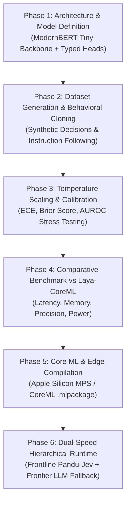

# Pandu-Jev NLP: Research & Implementation Plan
## Ultra-Fast, Lightweight (~15M–50M) Typed Decision Model with Zero Generated Tokens & Calibrated Fallback

**Authors / Engineering:** Lutfi & Antigravity AI Research Team  
**Date:** September 2026  
**Repository:** `pandu-jev` (`mini-jev`)  
**Target Document:** `docs/RESEARCH_PLAN.md`  
**Artifact Classification:** Core Research Strategy & Systems Architecture Specification  

---

## 1. Executive Summary & Problem Formulation

Modern autonomous agents and interactive decision systems face an architectural dilemma:

1. **Frontier Generative LLMs (Claude, GPT, LLaMA 8B–70B):**
   - Generalize well to natural language prompts and open-domain reasoning.
   - Suffer from prohibitive token latency (300 ms – 2,000 ms), high monetary cost ($0.002 – $0.05 per call), non-deterministic hallucination, and JSON formatting errors.
2. **Micro-Policies (Pandu Core <50K MLP/GRU):**
   - Deliver microsecond reflex speed (0.029 ms / 29 $\mu\text{s}$) with 0.86% ECE calibration and zero API cost.
   - Lack a token vocabulary; cannot comprehend natural language instructions, unstructured text context, or open-ended user queries.
3. **Heavyweight Typed Decision Models (Laya-CoreML 322M–421M):**
   - Successfully implement the *typed decision* paradigm (zero output tokens, structured `choice`, `score`, and `noul` probabilities).
   - Rely on a 322M–421M parameter ModernBERT-Base backbone, requiring ~400–800 MB memory footprint, complex Apple Neural Engine (ANE) tensor surgery, and ~5 ms latency.

### The Research Thesis
> **Can a compact 15M–50M parameter bidirectional transformer (ModernBERT-Tiny / Mini) equipped with typed decision heads achieve full natural language comprehension and decision accuracy while delivering sub-3ms latency, <60MB memory footprint, zero generated tokens, and calibrated uncertainty fallback?**

---

## 2. Architectural Comparison & Positioning

| Dimension | Pandu Core (Micro) | **Pandu-Jev NLP (Target)** | Laya-CoreML | Frontier LLM |
| :--- | :---: | :---: | :---: | :---: |
| **Parameter Budget** | 2.9K – 44.7K | **15M – 28M** | 322M – 421M | 8B – 70B+ |
| **Backbone Architecture** | MLP / GRU | **ModernBERT-Tiny (6L, d=256, RoPE)** | ModernBERT-Base (22–28L, d=768) | Decoder-Only AutoRegressive |
| **NLP Understanding** | ❌ (Numeric only) | **✅ Full (Kosakata 30k–50k, sintaksis, konteks)** | **✅ Full** | **✅ Full** |
| **Memory Footprint (FP16)** | < 0.1 MB | **~35 – 55 MB** | ~400 – 800 MB | 16,000 – 140,000 MB |
| **Output Mechanism** | Direct Policy Logits | **Typed Marker/Pooled Heads (0 Tokens)** | Typed Marker Heads (0 Tokens) | Autoregressive Token-by-Token |
| **Inference Latency** | 0.029 ms | **~1.5 – 3.0 ms (MPS/CoreML)** | ~5.0 ms (ANE) / ~15 ms (GPU) | 500 – 2,000 ms |
| **Deployment Complexity** | Trivial | **Low (Standard PyTorch / MPS / CoreML)** | Very High (ANE BC1L, 1x1 convs) | Requires Cloud GPUs / Ollama |
| **Dual-Speed Fallback** | Calibrated ($\tau=0.85$) | **Calibrated Confidence + Entropy Filter** | Fixed Temperature Buckets | N/A (Endpoint) |

---

## 3. Detailed Architecture: Pandu-Jev NLP

```text
┌─────────────────────────────────────────────────────────────────────────────┐
│                             Input Interface                                 │
│  State / Context (Text) + Instructions + Candidate Options / Criteria      │
└──────────────────────────────────────┬──────────────────────────────────────┘
                                       │
                                       ▼  (Subword Tokenizer)
┌─────────────────────────────────────────────────────────────────────────────┐
│                 ModernBERT-Tiny Encoder (~22M Parameters)                  │
│  - Layers: 6 Transformer Blocks                                             │
│  - Hidden Dimension: 256, FFN Intermediate: 1,024                          │
│  - Attention: 4 Heads, RoPE (Rotary Embeddings), Native SDPA / FlashAttention│
│  - Sequence Length: Dynamic up to 1,024 tokens                              │
└──────────────────────────────────────┬──────────────────────────────────────┘
                                       │
                    Token Embeddings & Option Markers h_i
                                       │
         ┌─────────────────────────────┼─────────────────────────────┐
         ▼                             ▼                             ▼
┌──────────────────┐          ┌──────────────────┐          ┌──────────────────┐
│   Choice Head    │          │    Score Head    │          │    Noul Head     │
│ Categorical over │          │ Continuous /     │          │ Boolean (Binary) │
│   K options      │          │ Ordinal [0, 1]   │          │ True/False Prob  │
└────────┬─────────┘          └────────┬─────────┘          └────────┬─────────┘
         │                             │                             │
         └─────────────────────────────┼─────────────────────────────┘
                                       ▼
┌─────────────────────────────────────────────────────────────────────────────┐
│                 Calibration & Dual-Speed Fallback Engine                    │
│  - Temperature Scaling: z_cal = z / T                                       │
│  - Telemetry: Top-1 Confidence, Margin (Top1 - Top2), Entropy H(p)          │
│  - Fallback Filter: If Confidence < tau (e.g., 0.85) -> Trigger Teacher LLM  │
└──────────────────────────────────────┬──────────────────────────────────────┘
                                       ▼
┌─────────────────────────────────────────────────────────────────────────────┐
│                        Typed Decision JSON Output                           │
│  Usage: { "input_tokens": N, "output_tokens": 0 }                           │
│  Answers: { "selection": "billing", "confidence": 0.941, "fallback": false }│
└─────────────────────────────────────────────────────────────────────────────┘
```

### 3.1 The Typed Decision Protocol
Following the zero-token paradigm, Pandu-Jev outputs no raw generated text strings, eliminating hallucination:

1. **`choice`**: Categorical classification across $K$ discrete options:
   $$\mathbf{p}_{\text{choice}} = \text{Softmax}\left(\frac{\mathbf{z}_{\text{choice}}}{T_{\text{choice}}}\right)$$
2. **`score`**: Expected value over ordered discrete levels:
   $$\text{score} = \sum_{j=0}^{M-1} j \cdot p_j$$
3. **`noul`**: Boolean affirmative/negative probability ($p(\text{True}) \in [0, 1]$).
4. **`fallback_trigger`**: Boolean flag indicating whether uncertainty exceeds the threshold:
   $$\text{should\_fallback} = \mathbb{I}(\max(\mathbf{p}) < \tau \lor \mathcal{H}(\mathbf{p}) > H_{\text{max}})$$

---

## 4. Phased Implementation Roadmap



### Phase 1: Architecture & Model Definition (`JEV-001`)
- **Objective:** Build `PanduJevNLP` in `src/models/jev_nlp.py`.
- **Key Modules:**
  - ModernBERT-Tiny configuration (`ModernBertConfig(hidden_size=256, num_hidden_layers=6, intermediate_size=1024, num_attention_heads=4)`).
  - Multi-task typed decision heads (`ChoiceHead`, `ScoreHead`, `NoulHead`, `ActConfidenceHead`).
  - Unified input parser accepting:
    ```python
    agent.predict(state_text, questions_dict)
    ```
- **Deliverables:**
  - `src/models/jev_nlp.py`
  - `tests/test_jev_nlp.py` (unit tests verifying shape, gradient flow, and output schema).

### Phase 2: Dataset Pipeline & Distillation (`JEV-002`)
- **Objective:** Create a multi-domain synthetic typed-decision dataset for training and validation.
- **Domains:**
  1. *Customer Support Routing:* (choice: department, score: urgency, noul: needs_escalation).
  2. *Software Engineering Safety Guard:* (choice: action, score: blast_radius, noul: is_destructive).
  3. *Autonomous Agent Navigation:* (choice: direction, score: path_hazard, noul: goal_reachable).
- **Deliverables:**
  - `src/datasets/decision_dataset.py`
  - `src/training/train_jev_nlp.py`

### Phase 3: Calibration & Uncertainty Evaluation (`JEV-003`)
- **Objective:** Quantify probability reliability using temperature scaling and uncertainty metrics.
- **Metrics:**
  - Expected Calibration Error (ECE) target: $< 2.0\%$.
  - Maximum Calibration Error (MCE) target: $< 15.0\%$.
  - Brier Score target: $< 0.08$.
  - AUROC on OOD / ambiguous query detection: $> 0.90$.
- **Deliverables:**
  - `src/evaluation/jev_calibration.py`
  - `experiments/results/jev_nlp_calibration.json`

### Phase 4: Head-to-Head Benchmark vs Laya-CoreML (`EXP-011`)
- **Objective:** Direct empirical comparison between Pandu-Jev NLP (~22M) and Laya-CoreML (322M).
- **Controlled Benchmarks:**
  - End-to-end decision latency (P50, P95, P99).
  - Peak memory footprint during execution.
  - Model load and cold-start time.
  - Decision accuracy on matched test fixtures.
- **Deliverables:**
  - `experiments/benchmarks/exp011_pandu_vs_laya.py`
  - Technical report section in `docs/RESEARCH.md`.

### Phase 5: Core ML & Edge Compilation (`JEV-004`)
- **Objective:** Export `PanduJevNLP` to Apple Silicon Core ML (`.mlpackage`).
- **Advantage over Laya:**
  - Because Pandu-Jev uses clean standard architectures without ANE-specific tensor workarounds, Core ML export is clean and portable to both macOS and iOS without custom shape slicing.
- **Deliverables:**
  - `src/models/export_coreml.py`
  - `checkpoints/pandu_jev_nlp.mlpackage`

### Phase 6: Dual-Speed Fallback Integration (`JEV-005`)
- **Objective:** Deploy Pandu-Jev as frontline System 1 filter in front of an LLM Teacher (Claude / GPT).
- **Target Empirical Outcome:**
  - 80–90% of requests handled locally by Pandu-Jev ($0 cost, ~2ms).
  - 10–20% of low-confidence requests routed to Teacher ($$).
  - Overall system matches 100% Teacher accuracy at 85% reduced cost and 80% reduced average latency.

---

## 5. Verification & Acceptance Criteria

Every milestone must pass strict empirical quality gates:

1. **Parameter Count:** Model parameters must remain within **15M – 28M** parameters.
2. **Memory Footprint:** Resident memory usage must stay **under 80 MB** (FP16).
3. **Latency:** Mean inference latency on Apple Silicon (MPS / CoreML) must remain **$< 3.0 \text{ ms}$**.
4. **Token Generation:** `usage["output_tokens"] == 0` strictly enforced across all predictions.
5. **Calibrated Reliability:** ECE post-calibration must remain **$< 2.5\%$**.
6. **Test Coverage:** All unit and integration test suites pass (`pytest tests/ -v`).

---

## 6. Project References

- [PLAN.md](PLAN.md) — Original 14-phase Mini-Jev research blueprint.
- [RESEARCH.md](RESEARCH.md) — Empirical research findings on micro-policies and scaling limits.
- [GROUNDED_LANGUAGE_ARCHITECTURE.md](GROUNDED_LANGUAGE_ARCHITECTURE.md) — Canonical Intent Protocol specification.
- [Laya-CoreML Reference Repo](/Users/hy4-mac-002/hasdev/research/laya-coreml) — Reference implementation for typed decisions on Apple Silicon.
- [kanban.md](../.kanban/kanban.md) — Single source of truth for task execution.
